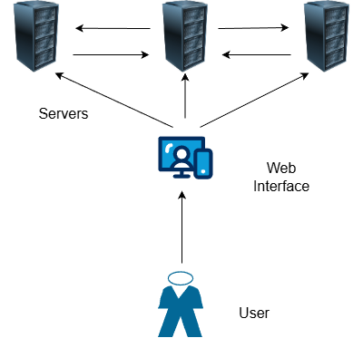

# pv204_gigaprojekt

Project in subject Security Technologies at FI MUNI.
The whole project is split in different phases I-V.
 - Phase I
    - finding team, choosing project topic, creating repository
 - Phase II
    - project design, prototype implementation, short report
 - Phase III
    - final implementation, preparation of project presentation
 - Phase IV
    - analysis of another teams project, project presentation
 - Phase V
    - discussion about project and discovered problems

Currently the project is in phase II. 
Choosen topic is **Trusted timestamping server with threshold signing key**.

## Project design

The design of a trusted timestamping system using a threshold signature scheme (TSS) requires a division into several main components: the client application or an interface for submitting documents , a some sort of network of signing nodes, and a some sort of communication layer for nodes coordination, key storage.

<div align="center">
  
</div>

### Basic workflow

On the start, the servers/nodes need to setup communication and share the parts private of key each of them generated as well with public key that needs to be provided for sharing with users. 
The sharing and creating of key package needs to be done via secure channels, and some further verification like all the nodes have corresponding share via broadcast channel.


Users workflow:

- user sends document for timestamping
- interface sends to document/hash of document and some information like time to corresponding **n** servers/nodes
- than the process of threshold signing 
    - nodes need to have the appropriate information
    - the **k** of **n** nodes generate sign
    - some sort of aggregation to final signature **$\sigma$**
- user gets signature (timestamp) **$\sigma$** (and  corresponding public key) 
- verification of the signature (timestamp) **$\sigma$** could be done either: 
    - by user with public key which was provided when signing the document
    - by the nodes/serves via the interface or some API

Also we would need to take in consideration of some authentication of the user.

### Technology choices
Key sharing: 
FROST(Flexible Round-Optimised Schnorr Threshold signatures) 

Interface/API:
FastAPI

Cryptography:
Schnorr signatures

As we choose Python as language for this project. Corresponding libraries will be choosen.

## Architecture

During our research we came across a Python implementation of FROST protocol:  https://github.com/zellular-xyz/pyfrost,
which we decided to use as skeleton/inspiration for our implementation, but we decided for some other technologies to provide the infrastructure needed in project e.g client interface, communication between nodes. 

1. Node Component Structure (Stand-alone FastAPI)
   Each node operates as an autonomous service. The FastAPI instance serves two distinct roles:
   - Public API: Receives timestamping requests from clients (hash submission).
   - Peer API: Facilitates the two-round FROST signing process between nodes.
   Internal Node Modules:Cryptography Engine: 
   - Handles `k-of-n` polynomial math, Lagrangian interpolation, and Schnorr signature generation.
   - State Machine: Tracks the lifecycle of a signing session (Round 1: Nonce generation; Round 2: Share submission).
   - Key Store: Encrypted storage for the individual's long-term secret share.
2. Communication Layer & Encryption
   All inter-node and client-node traffic must be encrypted to prevent Man-in-the-Middle (MitM) attacks and metadata leakage.
   - Transport Security: Mandatory TLS 1.3 for all FastAPI endpoints.
   - Mutual TLS (mTLS): Nodes must verify each other's identity using pre-distributed X.509 certificates. This prevents unauthorized nodes from joining the threshold group or soliciting nonces.
   - Message Integrity: Use of HMAC or digital signatures on the application layer to ensure that $P_i$ (commitment) and $s_i$ (signature share) are not tampered with during transit.
3. Key Generation (Distributed Key Generation - DKG)
   To maintain "Trusted" status, the private key $SK$ must never exist in one piece.
    - Pedersen DKG: Nodes perform a distributed handshake to generate the group public key $PK$ and their respective secret shares $s_i$.
    - Output: Each node receives its $s_i$ and the common $PK$. The $PK$ is then published as the "Root of Trust" for timestamp verification.
4. Signing Workflow (The Two-Round Process)
   Phase | Action | Detail
   --- | --- | ---
   Request | Client → Node (Coordinator) | Client sends H(M). Coordinator initiates a session. 
   Round 1 |	Node ↔ Node |	Selected k nodes generate and exchange public nonces.
   Round 2 |	Node ↔ Node |	Nodes compute their partial signatures using their secret share and the combined nonces.
   Aggregation |	Coordinator |	Coordinator aggregates partial signatures into a single Schnorr signature.
5. Data Handling & Security
    - Input Validation: FastAPI Pydantic models must enforce strict hexadecimal/base64 formats for hashes to prevent injection.
    - Authentication: * Clients: JWT (JSON Web Tokens) or API Keys for rate-limiting and identity.
      - Nodes: mTLS for peer-to-peer coordination.
    - No-State Persistence: To increase security, only the hash, timestamp, and the resulting signature.


## Example:

Basic setup of project in current phase of progress:

```bash
$ git clone https://github.com/makuga01/pv204_gigaprojekt.git
$ python3 -m venv venv
$ source venv/bin/activate  # Windows: venv\Scripts\activate
(venv) $ pip install -r requirements.txt
```

To run an example network, open `m` additional terminals for `m` nodes and activate the `venv` in these terminals.
Note that `m` is an arbitrary positive number, but it must not exceed 99 due to predefined nodes in the example setup.

Firstly initialize the nodes by typing the following command in `m` terminals:
(The `[1-m]` refers to ID of node, so start by `1` and going to `m`)
```bash
(venv) $ export NODE_NODE_ID="[1-m]"
(venv) $ export NODE_PORT=8080
(venv) $ export NODE_PEERS="2=http://127.0.0.1:8081,3=http://127.0.0.1:8082"
(venv) $ export PYTHONPATH=$(pwd)
(venv) $ python -m src.node.run
```

Now tell nodes to setup keys:
(Here `k` refers to a threshold number of nodes required for signing)
```bash
curl -X POST http://127.0.0.1:8080/public/dkg/init \
     -H "Content-Type: application/json" \
     -d '{"threshold": k, "total_nodes": m}'
```

Lastly sumbit request for signinging: 
```bash
curl -X POST http://127.0.0.1:8080/public/timestamp \
     -H "Content-Type: application/json" \
     -d '{
           "document_hash": "e3b0c44298fc1c149afbf4c8996fb92427ae41e4649b934ca495991b7852b855",
           "key_type": "ETH"
         }'
```

Also a status check for nodes is available:
```bash
curl -X GET http://127.0.0.1:8080/health
```

## Current state of implementation

Done:
 - nodes setup
 - dkg 
 - timestamp gen
 - simple script to verify signature

TODO:
 - interface for submitting
 - intergration for verifying
 - interface for verifying
